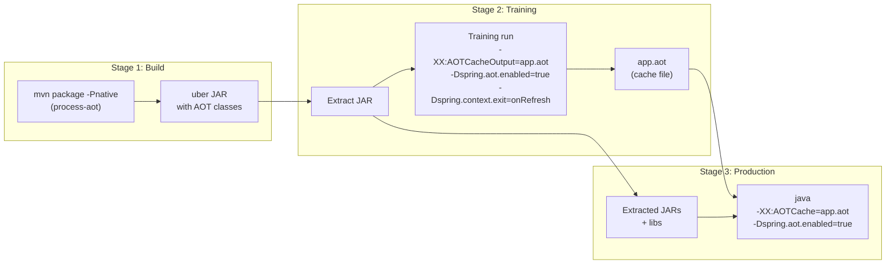
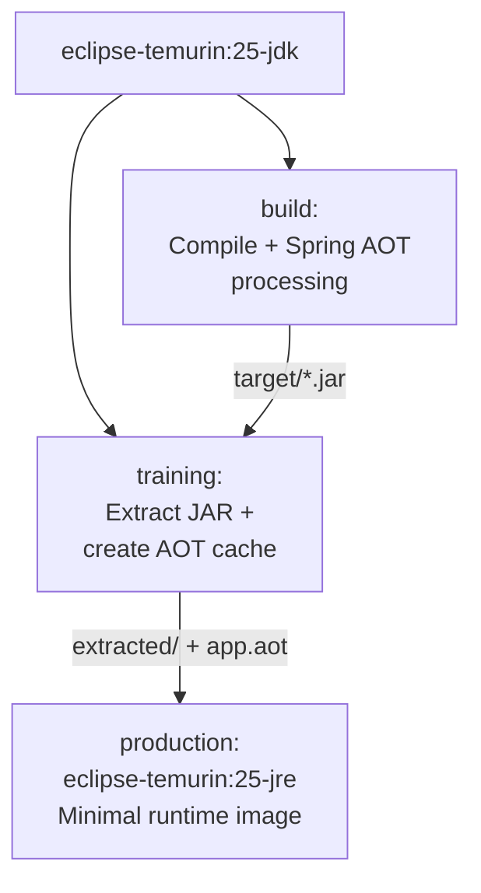
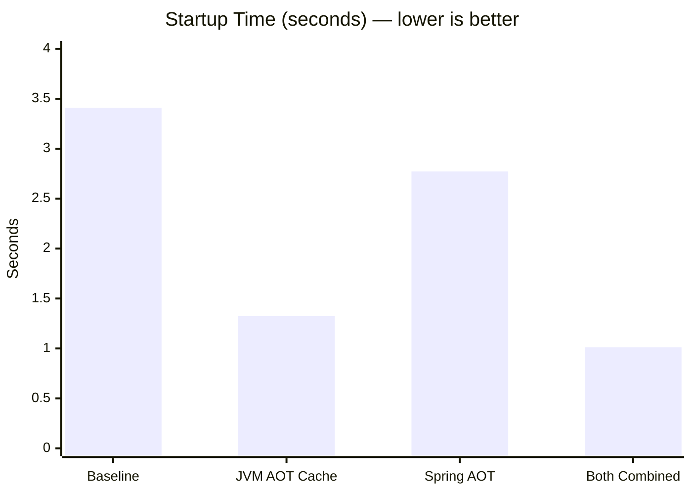

# Spring Boot AOT Cache + Spring AOT: Production Container Guide

## Overview

This guide shows how to build a production container image that combines **JVM AOT Cache** (Project Leyden) and **Spring AOT** for maximum startup performance. Based on benchmarks with Spring PetClinic on Java 25, this combination yields a **~4x startup speedup**.

| Optimization | What it does | When it runs |
|---|---|---|
| **Spring AOT** | Generates bean definitions, reflection hints, and repository implementations at build time | Maven build (`process-aot` goal) |
| **JVM AOT Cache** | Caches loaded/linked classes, resolved constant pools, and method profiles | Training run (creates `app.aot` file) |

## How It Works



### Container Build Stages



## Dockerfile

```dockerfile
# ============================================================
# Stage 1: Build the Spring AOT-processed JAR
# ============================================================
FROM eclipse-temurin:25-jdk AS build

WORKDIR /build
COPY . .

# -Pnative triggers the process-aot goal (Spring AOT code generation)
# We only need the JAR, not a native image
RUN ./mvnw package -DskipTests -Pnative

# ============================================================
# Stage 2: Extract JAR and create AOT cache (training run)
# ============================================================
FROM eclipse-temurin:25-jdk AS training

WORKDIR /app

# Copy the built JAR from the build stage
COPY --from=build /build/target/*.jar application.jar

# Extract the uber JAR (required for AOT cache - no nested JARs allowed)
RUN java -Djarmode=tools -jar application.jar extract --destination extracted

# Training run: creates the AOT cache file
# -Dspring.context.exit=onRefresh exits after context is fully initialized
# -Dspring.aot.enabled=true activates Spring AOT-generated code during training
RUN java \
    -XX:AOTCacheOutput=/app/app.aot \
    -Dspring.aot.enabled=true \
    -Dspring.context.exit=onRefresh \
    -jar extracted/*.jar

# ============================================================
# Stage 3: Production image
# ============================================================
FROM eclipse-temurin:25-jre AS production

WORKDIR /app

# Copy extracted JAR layout and AOT cache from training stage
COPY --from=training /app/extracted/ ./
COPY --from=training /app/app.aot ./app.aot

EXPOSE 8080

# Run with both optimizations enabled
ENTRYPOINT ["java", \
    "-XX:AOTCache=/app/app.aot", \
    "-Dspring.aot.enabled=true", \
    "-jar", "/app/spring-petclinic-4.0.0-SNAPSHOT.jar"]
```

> **Note:** Replace `spring-petclinic-4.0.0-SNAPSHOT.jar` with your actual JAR name, or use a glob pattern in a shell entrypoint.

### Generic ENTRYPOINT (auto-detects JAR name)

If you want the Dockerfile to work without hardcoding the JAR name:

```dockerfile
ENTRYPOINT ["sh", "-c", \
    "java -XX:AOTCache=/app/app.aot -Dspring.aot.enabled=true -jar /app/*.jar"]
```

## CI/CD Pipeline

### GitHub Actions

```yaml
name: Build and Push AOT-optimized Image

on:
  push:
    branches: [main]

jobs:
  build:
    runs-on: ubuntu-latest
    steps:
      - uses: actions/checkout@v4

      - name: Install Podman
        run: sudo apt-get update && sudo apt-get install -y podman

      - name: Login to Container Registry
        run: podman login ghcr.io -u ${{ github.actor }} -p ${{ secrets.GITHUB_TOKEN }}

      - name: Build and push
        run: |
          podman build -t ghcr.io/${{ github.repository }}:${{ github.sha }} .
          podman push ghcr.io/${{ github.repository }}:${{ github.sha }}
```

### GitLab CI

```yaml
build-aot-image:
  stage: build
  image: quay.io/podman/stable:latest
  script:
    - podman build -t $CI_REGISTRY_IMAGE:$CI_COMMIT_SHA .
    - podman push $CI_REGISTRY_IMAGE:$CI_COMMIT_SHA
```

## Important Constraints

### AOT Cache Requirements

| Requirement | Detail |
|---|---|
| **Same JVM** | The exact same JDK version must be used for training and production |
| **Classpath as JARs** | Must be a list of JARs — no directories, no wildcards, no nested JARs (that's why we extract) |
| **Preserved timestamps** | JAR file timestamps must not change between training and production |
| **Classpath superset** | Production classpath must be a superset of the training classpath |

The multi-stage Dockerfile satisfies all of these because stages 2 and 3 use the exact same extracted files.

### Spring AOT Restrictions

- Classpath is fixed at build time
- Bean definitions cannot change at runtime (no dynamic `@Profile` switching)
- `@ConditionalOnProperty` conditions are evaluated at build time

## Verifying It Works

### Check Spring AOT is active

Look for this in the startup log:

```
Starting AOT-processed PetClinicApplication ...
```

(Instead of the usual `Starting PetClinicApplication ...`)

### Check AOT Cache is loading classes

```dockerfile
# Add to ENTRYPOINT for debugging:
ENTRYPOINT ["java", \
    "-XX:AOTCache=/app/app.aot", \
    "-Xlog:class+load:file=/tmp/classload.log", \
    "-Dspring.aot.enabled=true", \
    "-jar", "/app/spring-petclinic-4.0.0-SNAPSHOT.jar"]
```

Then check the log:

```bash
podman exec <container> grep "shared objects file" /tmp/classload.log | head -5
```

Classes loaded from cache show `source: shared objects file`.

## Benchmark Results

Measured with Spring PetClinic on Java 25 + Spring Boot 4.0.3:



| Scenario | Startup | Speedup |
|---|---|---|
| 1. Baseline (no optimizations) | 3.410s | — |
| 2. JVM AOT Cache only | 1.324s | 2.6x |
| 3. Spring AOT only | 2.772s | 1.2x |
| 4. Spring AOT + JVM AOT Cache | 1.011s | **3.4x** |

Spring AOT alone provides a modest improvement, but combining it with the JVM AOT Cache delivers the biggest win — **startup drops from 3.4s to 1.0s**.

### Podman (Containerized)

| Scenario | Startup |
|---|---|
| Baseline (no optimizations) | 3.646s |
| Spring AOT + JVM AOT Cache | 1.321s |

## Going Further: Real Training Runs

The `onRefresh` training is a "poor man's training run" — it captures class loading but **not method profiles**. For even better warm-up performance, replace the training stage with a real workload:

```dockerfile
FROM eclipse-temurin:25-jdk AS training

WORKDIR /app
COPY --from=build /build/target/*.jar application.jar
RUN java -Djarmode=tools -jar application.jar extract --destination extracted

# Start the app, send traffic, then stop to create the cache
RUN java -XX:AOTCacheOutput=/app/app.aot \
         -Dspring.aot.enabled=true \
         -jar extracted/*.jar & \
    APP_PID=$! && \
    sleep 15 && \
    for i in $(seq 1 50); do \
        curl -s http://localhost:8080/ > /dev/null; \
        curl -s http://localhost:8080/owners > /dev/null; \
        curl -s http://localhost:8080/vets.html > /dev/null; \
    done && \
    kill $APP_PID && \
    wait $APP_PID || true
```

This captures method execution profiles in the cache (JDK 25+), improving not just startup but also warm-up time.
